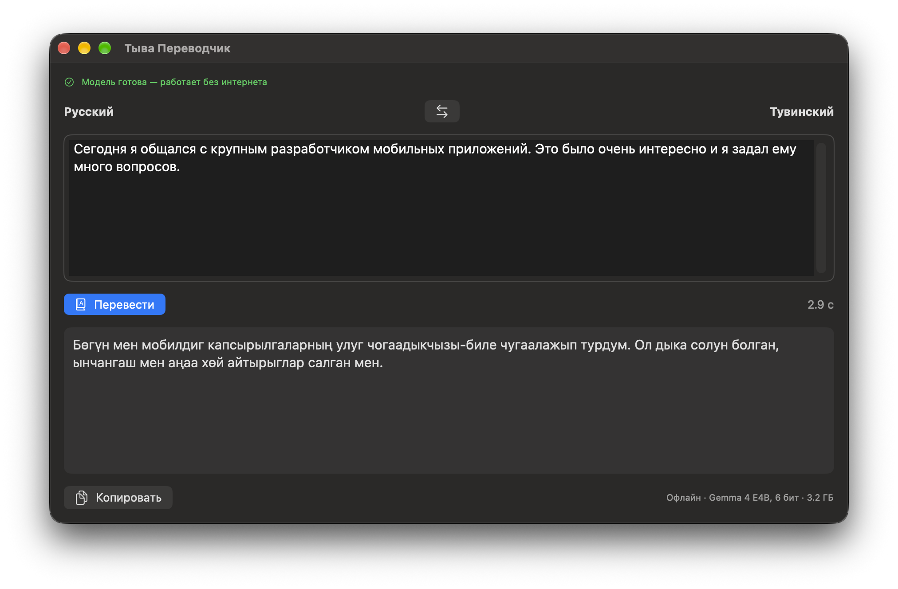
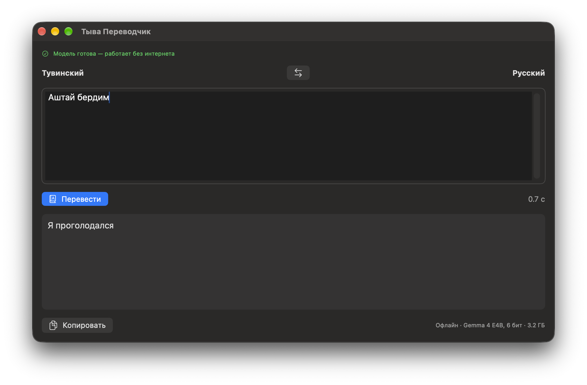

# Russian ↔ Tuvan machine translation on Apple devices

[](https://colab.research.google.com/github/Agisight/tyv-translation-mlx/blob/main/colab/train_gemma4_tyv_colab.ipynb)

Code, data preparation and evaluation for offline Russian ↔ Tuvan translation. Tuvan is a
low-resource Turkic language with roughly 280,000 speakers.

- **NLLB v3 on MLX** — a from-scratch MLX implementation of the NLLB (M2M100) encoder-decoder
  with a KV cache. float32 reproduces PyTorch exactly; the 8-bit version is lossless and ~3× faster.
- **Gemma 4 E4B + LoRA** — a fine-tuned LLM that significantly outperforms the specialized NLLB v3
  model in both directions, converted to MLX for Mac.
- **Vocabulary pruning** — Gemma's 262K-token vocabulary cut to 22.7K tokens and the vision/audio towers
  removed: half the size (4.3B parameters) with the same quality; at 6 bits it is 3.2 GB and still beats NLLB.
- **A clean test set and honest evaluation** — chrF++, BLEU, COMET, paired bootstrap significance,
  and a normalized chrF++ that does not penalize gender (Tuvan has none) or word forms.

Русская пошаговая инструкция для Mac: [README.ru.md](README.ru.md). Журнал экспериментов: [EXPERIMENTS.ru.md](EXPERIMENTS.ru.md). Experiment log: [EXPERIMENTS.md](EXPERIMENTS.md).

## Results

Clean test set, 1,369 pairs (see [Test set](#test-set)). Latency: median per sentence, MacBook Air M4 (16 GB).

| Model | Size | chrF++ ru→tyv | chrF++ tyv→ru | COMET tyv→ru | Latency |
|---|---|---|---|---|---|
| NLLB v3, PyTorch / MLX float32 | 1.4 GB | 49.2 | 49.1 | 0.806 | 0.19 / 0.12 s |
| NLLB v3, MLX 8-bit | 400 MB | 49.3 | 48.8 | 0.806 | 0.07 / 0.06 s |
| NLLB v3, MLX 4-bit | 224 MB | 48.5 | 48.1 | 0.800 | 0.05 / 0.03 s |
| **Gemma 4 E4B + LoRA, bf16** | 16 GB | **50.5** | **50.9** | **0.827** | — |
| **Gemma 4 E4B + LoRA, MLX 8-bit** | 8.4 GB | **50.3** | **50.9** | — | 0.89 s |
| Gemma 4 E4B + LoRA, MLX 4-bit ¹ | 4.9 GB | 48.2 | 44.3 | — | 0.53 s |
| **Gemma, pruned vocabulary, text-only, bf16** | 8.0 GB | **50.5** | **50.8** | — | — |
| **Gemma, pruned, MLX 6-bit (on-device)** | **3.2 GB** | **50.2** | **50.8** | — | 0.79 s |
| Gemma, pruned, MLX 5-bit | 2.7 GB | 49.7 | 49.9 | — | 0.93 s |
| Gemma, pruned, MLX 4-bit ¹ | 2.3 GB | 47.9 | 43.3 | — | 0.94 s |

¹ First 100 pairs only (bf16 on the same pairs: 51.1 / 49.6) — 4-bit quantization hurts Gemma noticeably, while 8-bit is lossless.

Gemma vs. NLLB v3: p = 0.009 (ru→tyv) and p = 0.001 (tyv→ru), paired bootstrap on chrF++.
On the full 1,999-pair NLLB test set: Gemma 49.7 / 49.9 vs. NLLB 48.5 / 48.1.

Quantization of the pruned model: **6 bits keep the full model's quality** (vs. bf16 p = 0.12 / 0.29; vs. NLLB significantly better, p = 0.029 / 0.002) at 3.2 GB — 5× smaller than the 16 GB fine-tuned model. 5 bits cost ~1 point (significant), below 5 bits quality drops sharply — translation into Russian is the most sensitive. Full sweep in [EXPERIMENTS.md](EXPERIMENTS.md).

## Models

| Model | Format | Use on |
|---|---|---|
| [Agisight/nllb-rus-tyv-v3-dict_16.5k](https://huggingface.co/Agisight/nllb-rus-tyv-v3-dict_16.5k) | PyTorch, float32 | any (transformers) |
| [Agisight/nllb-rus-tyv-v3-mlx-q8](https://huggingface.co/Agisight/nllb-rus-tyv-v3-mlx-q8) | MLX 8-bit | Mac (recommended) |
| [Agisight/nllb-rus-tyv-v3-mlx-q4](https://huggingface.co/Agisight/nllb-rus-tyv-v3-mlx-q4) | MLX 4-bit | Mac, low memory |
| [Agisight/tyv-gemma4-e4b-lora](https://huggingface.co/Agisight/tyv-gemma4-e4b-lora) | LoRA adapter for `google/gemma-4-E4B-it` | GPU (transformers + peft) |
| [Agisight/tyv-gemma4-e4b-pruned-mlx-6bit](https://huggingface.co/Agisight/tyv-gemma4-e4b-pruned-mlx-6bit) | MLX 6-bit, pruned vocabulary, text-only | Mac and on-device (**recommended**) |
| [Agisight/tyv-gemma4-e4b-mlx-8bit](https://huggingface.co/Agisight/tyv-gemma4-e4b-mlx-8bit) | MLX 8-bit (merged, full vocabulary) | Mac, 16 GB+ |

## Quick start: translate

All commands run from the repository root.

```bash
python3.12 -m venv .venv && source .venv/bin/activate
pip install -r requirements.txt
```

**NLLB v3 on a Mac (MLX, fastest):**

```bash
hf download Agisight/nllb-rus-tyv-v3-mlx-q8 --local-dir models/nllb-v3-mlx-q8
python evaluate_nllb_mlx.py --model models/nllb-v3-mlx-q8 --text "Завтра я поеду в Кызыл к родителям."
python evaluate_nllb_mlx.py --model models/nllb-v3-mlx-q8 --dir tyv-ru --text "Экии!"
```

**Gemma on a Mac (MLX):** the prompt format is `ru→tyv: <text>` or `tyv→ru: <text>`.

```bash
mlx_lm.generate --model Agisight/tyv-gemma4-e4b-pruned-mlx-6bit \
  --prompt "ru→tyv: Завтра я поеду в Кызыл к родителям." --max-tokens 64 --temp 0.0
```

**Gemma on a GPU (transformers + peft):** see the code example in the
[adapter card](https://huggingface.co/Agisight/tyv-gemma4-e4b-lora).

## App for Mac, iPad and iPhone

<p>
  
  
</p>

A SwiftUI app in [`app/`](app/) runs the pruned 6-bit Gemma fully offline with
[mlx-swift-lm](https://github.com/ml-explore/mlx-swift-lm): about 0.9 s per sentence on a MacBook Air M4.
The prompt is built exactly as in training, with greedy decoding.

```bash
brew install xcodegen
cd app && xcodegen && open TyvaTranslator.xcodeproj
```

Pick your team in Signing & Capabilities, choose **My Mac**, press ⌘R. The first launch downloads the
model (~3.4 GB); after that it works without internet. iPad and iPhone need a real device with 8 GB of RAM
(iPad with an M chip, iPhone 15 Pro or newer) — the simulator has no Apple Silicon GPU for MLX. Details:
[app/README.md](app/README.md).

## Reproduce from scratch

### 1. Data and test set

```bash
python prepare_data.py
```

Downloads [Agisight/tyv-rus-200k](https://huggingface.co/datasets/Agisight/tyv-rus-200k) and builds
the NLLB v3 split, the clean test set, and chat-format training files in `data/`.

### 2. NLLB v3 baseline

```bash
python prepare_data.py --keep-dup-test && python evaluate_nllb.py   # reproduces the model card: 48.5 / 48.1
python prepare_data.py && python evaluate_nllb.py                   # clean test: 49.2 / 49.1
```

### 3. NLLB v3 → MLX

```bash
python convert_nllb_mlx.py --bits 8          # also: no flag (float32), --bits 4, --dtype float16
python evaluate_nllb_mlx.py --model models/nllb-v3-mlx-q8
python bench_nllb_mlx.py --model models/nllb-v3-mlx-q8
```

### 4. Train Gemma 4 E4B + LoRA (Google Colab, A100)

Click **Open in Colab** above, choose an A100 runtime with High-RAM, and run all cells. The notebook
downloads `prepare_data.py` from this repository, trains on the full training set (1 epoch,
~7.5 hours), evaluates on the clean and full test sets, and keeps checkpoints on Google Drive so an
interrupted run resumes. Publishing (cell 10) and MLX conversion (cell 11) are off by default.

### 5. Gemma on MLX (Mac)

```bash
hf download Agisight/tyv-gemma4-e4b-mlx-8bit --local-dir models/tyv-gemma4-e4b-mlx-8bit
python evaluate_gemma_mlx.py --model models/tyv-gemma4-e4b-mlx-8bit   # resumable; ~1 hour on a MacBook Air
```

### 6. Vocabulary pruning (Google Colab, A100)

Open `colab/prune_gemma4_vocab_colab.ipynb` in Colab (A100, High-RAM) and run all cells. It selects the
tokens used in the training data, rebuilds the BPE tokenizer and verifies it tokenizes exactly like the
original, merges the adapter, keeps only the language model, slices the vocabulary-sized tables, evaluates
on the clean test set, and converts to MLX 8 and 4 bits (~1–1.5 hours).

### 7. Metrics and significance

```bash
python significance.py eval_results_nllb.jsonl eval_results_gemma4.json      # paired bootstrap
python metrics_extra.py eval_results_nllb.jsonl eval_results_gemma4.json     # normalized chrF++
```

COMET needs a separate environment (see `requirements-comet.txt`):

```bash
python3.12 -m venv .venv-comet && source .venv-comet/bin/activate
pip install -r requirements-comet.txt
python comet_eval.py eval_results_nllb.jsonl eval_results_gemma4.json
```

### 8. Small LLM on a MacBook (MLX LoRA)

An early experiment: Qwen3-1.7B fine-tuned on a MacBook Air with `mlx_lm.lora` (`legacy/qwen/`). It works end to end but reaches only ~12–15 chrF++ — the laptop GPU
saw ~4% of the data. Step-by-step instructions are in [README.ru.md](README.ru.md).

## Test set

The test set is the held-out split used to train and evaluate NLLB v3: `filter → shuffle(seed=42) →
pairs 2000–4000` of the dataset. 630 of its 1,999 pairs also appear in the training data (the dataset
contains duplicates), so we report results on the **clean subset of 1,369 pairs** and, for
comparison with earlier work, on the full 1,999 pairs. Conclusions are the same on both.

## Repository

| Path | What it does |
|---|---|
| `prepare_data.py` | Data split, clean test set, chat-format training data |
| `evaluate_nllb.py` | NLLB v3 baseline in PyTorch (same settings as its training) |
| `nllb_mlx.py`, `convert_nllb_mlx.py` | NLLB (M2M100) in MLX; weight conversion and quantization |
| `evaluate_nllb_mlx.py`, `bench_nllb_mlx.py` | MLX quality evaluation; single-sentence latency and memory |
| `evaluate_gemma_mlx.py` | Gemma MLX evaluation (mlx-vlm or mlx-lm), per-sentence latency and memory |
| `colab/train_gemma4_tyv_colab.ipynb` | Gemma 4 E4B LoRA training, evaluation, MLX conversion |
| `colab/prune_gemma4_vocab_colab.ipynb` | Gemma vocabulary pruning, text-only model, evaluation, MLX |
| `significance.py`, `metrics_extra.py`, `comet_eval.py` | Significance test, normalized chrF++, COMET |
| `make_human_eval.py`, `count_human_eval.py` | Native-speaker review of quantization differences |
| `app/` | SwiftUI app (Mac, iPad, iPhone) running the pruned 6-bit Gemma with mlx-swift-lm |
| `upload_*.py` | Publishing models and model cards to Hugging Face |
| `eval_results_*` | Saved translations used for all reported metrics |

## License

Code: MIT. Models keep their own licenses: NLLB-based models CC-BY-NC-4.0 (from Meta's NLLB-200),
Gemma-based models Apache-2.0.

## Author

Ali Kuzhuget. NLLB v3 fine-tuning builds on David Dale's NLLB fine-tuning code, with his consultation.
