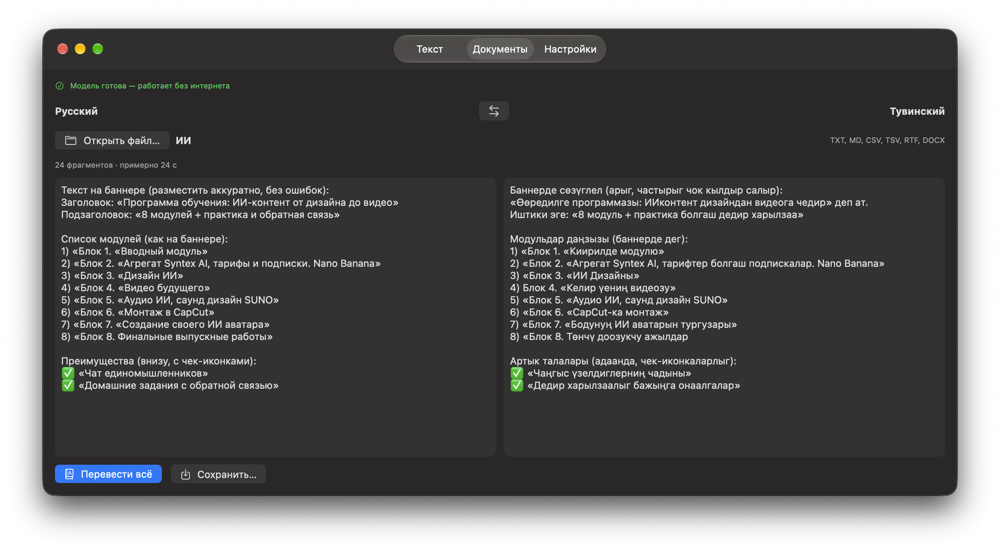

# Машинный перевод русский ↔ тувинский на устройствах Apple

[](https://colab.research.google.com/github/Agisight/tyv-translation-mlx/blob/main/colab/train_gemma4_tyv_colab.ipynb)

> English version: [README.md](README.md). Журнал экспериментов: [EXPERIMENTS.ru.md](EXPERIMENTS.ru.md) (рус.), [EXPERIMENTS.md](EXPERIMENTS.md) (англ.).

Код, подготовка данных и оценка для офлайн-перевода русский ↔ тувинский. Тувинский — тюркский язык
примерно с 280 тысячами носителей, для которого мало данных для обучения моделей.

- **NLLB v3 на MLX** — собственная реализация энкодер-декодера NLLB (M2M100) на MLX с KV-кэшем.
  float32 воспроизводит PyTorch в точности; 8-битная версия без потерь и примерно в 3 раза быстрее.
- **Gemma 4 E4B + LoRA** — дообученная LLM, которая значимо превосходит специализированную модель
  NLLB v3 в обе стороны; сконвертирована в MLX для Мака.
- **Сокращение словаря** — словарь Gemma уменьшен с 262 тысяч токенов до 22.7 тысячи, блоки зрения и
  звука убраны: модель вдвое меньше (4.3 млрд параметров) при том же качестве; в 6 битах — 3.2 ГБ, и всё
  ещё лучше NLLB.
- **Чистый тест и честная оценка** — chrF++, BLEU, COMET, статистическая значимость (paired bootstrap)
  и нормализованный chrF++, который не штрафует за род (в тувинском его нет) и формы слов.

## Результаты

Чистый тест, 1369 пар (см. [Тест](#тест)). Время — медиана на одно предложение, MacBook Air M4 (16 ГБ).

| Модель | Размер | chrF++ ru→tyv | chrF++ tyv→ru | COMET tyv→ru | Время |
|---|---|---|---|---|---|
| NLLB v3, PyTorch / MLX float32 | 1.4 ГБ | 49.2 | 49.1 | 0.806 | 0.19 / 0.12 с |
| NLLB v3, MLX 8 бит | 400 МБ | 49.3 | 48.8 | 0.806 | 0.07 / 0.06 с |
| NLLB v3, MLX 4 бита | 224 МБ | 48.5 | 48.1 | 0.800 | 0.05 / 0.03 с |
| **Gemma 4 E4B + LoRA, bf16** | 16 ГБ | **50.5** | **50.9** | **0.827** | — |
| **Gemma 4 E4B + LoRA, MLX 8 бит** | 8.4 ГБ | **50.3** | **50.9** | — | 0.89 с |
| Gemma 4 E4B + LoRA, MLX 4 бита ¹ | 4.9 ГБ | 48.2 | 44.3 | — | 0.53 с |
| **Gemma, сокращённый словарь, только текст, bf16** | 8.0 ГБ | **50.5** | **50.8** | — | — |
| **Gemma, сокращённая, MLX 6 бит (для устройств)** | **3.2 ГБ** | **50.2** | **50.8** | — | 0.79 с |
| Gemma, сокращённая, MLX 5 бит | 2.7 ГБ | 49.7 | 49.9 | — | 0.93 с |
| Gemma, сокращённая, MLX 4 бита ¹ | 2.3 ГБ | 47.9 | 43.3 | — | 0.94 с |

¹ Только первые 100 пар (bf16 на тех же парах: 51.1 / 49.6) — 4-битная квантизация заметно ухудшает
Gemma, тогда как 8 бит — без потерь.

Gemma против NLLB v3: p = 0.009 (ru→tyv) и p = 0.001 (tyv→ru), paired bootstrap по chrF++.
На полном тесте NLLB из 1999 пар: Gemma 49.7 / 49.9 против NLLB 48.5 / 48.1.

Квантизация сокращённой модели: **6 бит сохраняют качество полной модели** (против bf16 p = 0.12 / 0.29;
против NLLB значимо лучше, p = 0.029 / 0.002) при 3.2 ГБ — в 5 раз меньше дообученной модели на 16 ГБ.
5 бит теряют около 1 пункта (значимо), ниже 5 бит качество резко падает — сильнее всего страдает перевод
на русский. Полный перебор — в [EXPERIMENTS.ru.md](EXPERIMENTS.ru.md).

## Модели

| Модель | Формат | Где запускать |
|---|---|---|
| [Agisight/nllb-rus-tyv-v3-dict_16.5k](https://huggingface.co/Agisight/nllb-rus-tyv-v3-dict_16.5k) | PyTorch, float32 | где угодно (transformers) |
| [Agisight/nllb-rus-tyv-v3-mlx-q8](https://huggingface.co/Agisight/nllb-rus-tyv-v3-mlx-q8) | MLX 8 бит | Мак (рекомендуется) |
| [Agisight/nllb-rus-tyv-v3-mlx-q4](https://huggingface.co/Agisight/nllb-rus-tyv-v3-mlx-q4) | MLX 4 бита | Мак, мало памяти |
| [Agisight/tyv-gemma4-e4b-lora](https://huggingface.co/Agisight/tyv-gemma4-e4b-lora) | LoRA-адаптер для `google/gemma-4-E4B-it` | GPU (transformers + peft) |
| [Agisight/tyv-gemma4-e4b-pruned-mlx-6bit](https://huggingface.co/Agisight/tyv-gemma4-e4b-pruned-mlx-6bit) | MLX 6 бит, сокращённый словарь, только текст | Мак и устройства (**рекомендуется**) |
| [Agisight/tyv-gemma4-e4b-mlx-8bit](https://huggingface.co/Agisight/tyv-gemma4-e4b-mlx-8bit) | MLX 8 бит (слитая, полный словарь) | Мак, от 16 ГБ |

## Быстрый старт: перевести

Все команды — из корня репозитория.

```bash
python3.12 -m venv .venv && source .venv/bin/activate
pip install -r requirements.txt
```

**NLLB v3 на Маке (MLX, быстрее всего):**

```bash
hf download Agisight/nllb-rus-tyv-v3-mlx-q8 --local-dir models/nllb-v3-mlx-q8
python evaluate_nllb_mlx.py --model models/nllb-v3-mlx-q8 --text "Завтра я поеду в Кызыл к родителям."
python evaluate_nllb_mlx.py --model models/nllb-v3-mlx-q8 --dir tyv-ru --text "Экии!"
```

**Gemma на Маке (MLX):** формат промпта — `ru→tyv: <текст>` или `tyv→ru: <текст>`.

```bash
mlx_lm.generate --model Agisight/tyv-gemma4-e4b-pruned-mlx-6bit \
  --prompt "ru→tyv: Завтра я поеду в Кызыл к родителям." --max-tokens 64 --temp 0.0
```

**Gemma на GPU (transformers + peft):** пример кода — в
[карточке адаптера](https://huggingface.co/Agisight/tyv-gemma4-e4b-lora).

## Приложение для Мака, iPad и iPhone

<p>
  
  
</p>

SwiftUI-приложение в [`app/`](app/) запускает сокращённую 6-битную Gemma полностью офлайн через
[mlx-swift-lm](https://github.com/ml-explore/mlx-swift-lm): около 0.9 с на предложение на MacBook Air M4.
Промпт собирается ровно как при обучении, генерация жадная.

- **Текст** — вывод токен за токеном, длинный текст сам режется на предложения, прогресс и остановка.
- **Документы** — TXT, MD, CSV, TSV, RTF и DOCX (macOS): файл целиком по предложениям или выбранная колонка
  таблицы — новой колонкой; сохранение в TXT или CSV. Буллеты, эмодзи и нумерация сохраняются как есть.



```bash
brew install xcodegen
cd app && xcodegen && open TyvaTranslator.xcodeproj
```

В Signing & Capabilities выбери свою команду, цель — **My Mac**, нажми ⌘R. При первом запуске
приложение скачает модель (~3.4 ГБ), дальше работает без интернета. Для iPad и iPhone нужно реальное
устройство с 8 ГБ памяти (iPad с чипом M, iPhone 15 Pro и новее) — в симуляторе нет видеокарты Apple
Silicon для MLX. Подробности: [app/README.ru.md](app/README.ru.md).

## Воспроизвести с нуля

### 1. Данные и тест

```bash
python prepare_data.py
```

Скачивает [Agisight/tyv-rus-200k](https://huggingface.co/datasets/Agisight/tyv-rus-200k) (версия
зафиксирована) и собирает сплит NLLB v3, чистый тест и обучающие файлы в формате чата в `data/`.

### 2. Эталон NLLB v3

```bash
python prepare_data.py --keep-dup-test && python evaluate_nllb.py   # воспроизводит карточку модели: 48.5 / 48.1
python prepare_data.py && python evaluate_nllb.py                   # чистый тест: 49.2 / 49.1
```

### 3. NLLB v3 → MLX

```bash
python convert_nllb_mlx.py --bits 8          # также: без флага (float32), --bits 4, --dtype float16
python evaluate_nllb_mlx.py --model models/nllb-v3-mlx-q8
python bench_nllb_mlx.py --model models/nllb-v3-mlx-q8
```

### 4. Обучить Gemma 4 E4B + LoRA (Google Colab, A100)

Нажми **Open in Colab** выше, выбери среду A100 с High-RAM и «Выполнить все». Ноутбук сам скачивает
`prepare_data.py` из этого репозитория, обучает на всём train (1 эпоха, ~7.5 часа), оценивает на чистом
и полном тесте и хранит чекпойнты на Google Диске, так что прерванное обучение продолжается.
Публикация (ячейка 10) и конвертация в MLX (ячейка 11) по умолчанию выключены.

### 5. Gemma на MLX (Мак)

```bash
hf download Agisight/tyv-gemma4-e4b-mlx-8bit --local-dir models/tyv-gemma4-e4b-mlx-8bit
python evaluate_gemma_mlx.py --model models/tyv-gemma4-e4b-mlx-8bit   # можно прерывать; ~1 час на MacBook Air
```

### 6. Сокращение словаря (Google Colab, A100)

Открой `colab/prune_gemma4_vocab_colab.ipynb` в Colab (A100, High-RAM) и «Выполнить все». Ноутбук
выбирает токены из обучающих данных, пересобирает BPE-токенизатор и проверяет, что он режет текст точно
так же, как исходный, сливает адаптер, оставляет только языковую модель, вырезает строки таблиц словаря,
оценивает на чистом тесте и конвертирует в MLX 8 и 4 бита (~1–1.5 часа).

### 7. Метрики и значимость

```bash
python significance.py eval_results_nllb.jsonl eval_results_gemma4.json      # paired bootstrap
python metrics_extra.py eval_results_nllb.jsonl eval_results_gemma4.json     # нормализованный chrF++
```

COMET нужно отдельное окружение (см. `requirements-comet.txt`):

```bash
python3.12 -m venv .venv-comet && source .venv-comet/bin/activate
pip install -r requirements-comet.txt
python comet_eval.py eval_results_nllb.jsonl eval_results_gemma4.json
```

### 8. Небольшая LLM на MacBook (MLX LoRA)

Ранний эксперимент: Qwen3-1.7B, дообученная на MacBook Air через `mlx_lm.lora` (`legacy/qwen/`).
Весь путь работает, но качество всего ~12–15 chrF++ — видеокарта ноутбука успела показать модели около
4% данных. Пошаговая инструкция — в [legacy/qwen/README.ru.md](legacy/qwen/README.ru.md).

## Тест

Тест — это отложенная часть данных, на которой обучалась и оценивалась NLLB v3: `filter →
shuffle(seed=42) → пары 2000–4000` датасета. 630 из его 1999 пар встречаются и в обучающих данных
(в датасете есть повторы), поэтому основные результаты — на **чистой части из 1369 пар**, а для
сравнения с предыдущей работой — на полных 1999 парах. Выводы на обоих совпадают.

## Репозиторий

| Путь | Что делает |
|---|---|
| `prepare_data.py` | Сплит данных, чистый тест, обучающие данные в формате чата |
| `evaluate_nllb.py` | Эталон NLLB v3 в PyTorch (те же настройки, что при обучении) |
| `nllb_mlx.py`, `convert_nllb_mlx.py` | NLLB (M2M100) на MLX; конвертация и квантизация весов |
| `evaluate_nllb_mlx.py`, `bench_nllb_mlx.py` | Оценка качества на MLX; время и память на одно предложение |
| `evaluate_gemma_mlx.py` | Оценка Gemma на MLX (mlx-vlm или mlx-lm), время и память на предложение |
| `colab/train_gemma4_tyv_colab.ipynb` | Обучение Gemma 4 E4B с LoRA, оценка, конвертация в MLX |
| `colab/prune_gemma4_vocab_colab.ipynb` | Сокращение словаря Gemma, текстовая модель, оценка, MLX |
| `significance.py`, `metrics_extra.py`, `comet_eval.py` | Значимость, нормализованный chrF++, COMET |
| `make_human_eval.py`, `count_human_eval.py` | Ручная оценка носителем отличий при квантизации |
| `app/` | SwiftUI-приложение (Мак, iPad, iPhone) с сокращённой 6-битной Gemma на mlx-swift-lm |
| `upload_*.py` | Публикация моделей и карточек на Hugging Face |
| `eval_results_*` | Сохранённые переводы, по которым посчитаны все метрики |
| `legacy/qwen/` | Ранний эксперимент с Qwen3-1.7B на MacBook |

## Лицензия

Код: MIT. У моделей свои лицензии: модели на основе NLLB — CC-BY-NC-4.0 (от NLLB-200 компании Meta),
модели на основе Gemma — Apache-2.0.

## Автор

Али Кужугет. Дообучение NLLB v3 основано на коде дообучения NLLB Давида Дале, с его консультацией.
